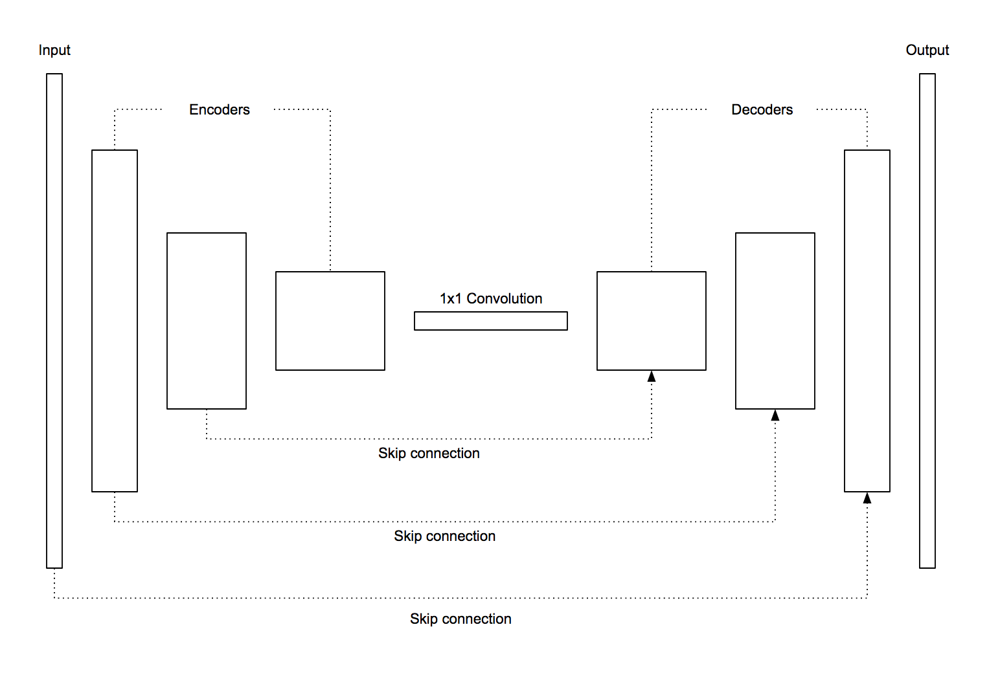
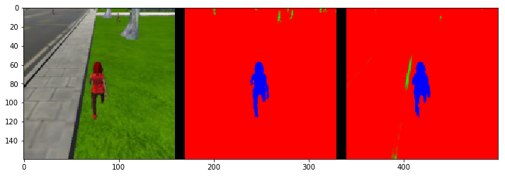
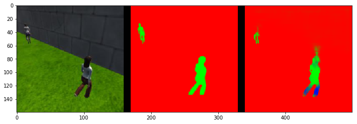
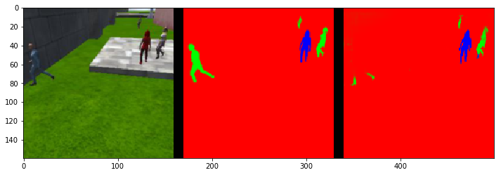

# Project: Follow Me
In this project, I’ve trained Fully Convolutional Network to make drone to follow the target in simulator environment. 


## Files
- `writeup.md`: Project writeup
- `writeup/*.*`Images for writeup
- `code/model_training.ipynb`: jupyter notebook file for training. Contains code for network implementation and training.
- `model_training.html`: An html version of jupyter notebook. 
-  `data/weights/model_weights.h5`: Trained model of FCN. You can use this model to follow target in simulator.

## Network Architecture
The network consists of  3 encoder layers and 3 decoder layers connected with 1x1 convolution layer. Decoders are concatenated by skip connection with corresponding encoders and input layer.

### Diagram of network layers and connections


### Implementations
Here are actual implementations of code encoder and decoder blocks and FCN model.

#### Encoder block
It’s in the 4th block of `code/model_training.ipynb`. It simply applies depthwise separable convolution and batch normalization to input layer. It drastically reduces parameters needed than normal convolution. So it’s a lot faster and efficient.
```python
def encoder_block(input_layer, filters, strides):
    output_layer = separable_conv2d_batchnorm(input_layer, filters, strides)
    return output_layer
```

#### Decoder block
It’s in the 5th block of `code/model_training.ipnyb`. It first upsamples input layer. After upsampling, we have bigger image with detected information, but the image itself has low definition. To solve this problem, we concatenate the result with **skip connected** layer from encoders or input. It revives image definition and preserves detail. Finally, add separable convolution and batch normalization three times.
```python
def decoder_block(small_ip_layer, large_ip_layer, filters):
    upsampled = bilinear_upsample(small_ip_layer)
    concat_layer = layers.concatenate([upsampled, large_ip_layer])
    output_layer = separable_conv2d_batchnorm(concat_layer, filters)
    output_layer = separable_conv2d_batchnorm(output_layer, filters)
    output_layer = separable_conv2d_batchnorm(output_layer, filters)
    return output_layer
```

#### 1x1 convolution
When we make a classifier, we use fully connected layer at the end. It can tell probabilities like if there’s target or not. But in this project, we want to know not only **if** there’s target, bu also **where** is target. To know where, or exact pixels, fully connected layer is not enough. We have to preserve spatial information after applying fully connected layer. A 1x1 convolution acts just what we want. It detects probabilities just like fully connected layer and also preserves spatial information and pass it to the following decoders.

#### FCN model
It’s in the 6th block of `code/model_training.ipnyb`. It utilizes previously defined encoder and decoder block. First, add three encoder blocks to input layer. Then apply 1x1 convolution to detect target preserving spatial information. Lastly, add three decoder blocks to restore image.
```python
def fcn_model(inputs, num_classes):
    # Encoders
    e0 = encoder_block(inputs, 32, strides=2)
    e1 = encoder_block(e0, 64, strides=2)
    e2 = encoder_block(e1, 128, strides=2)
    
    # 1x1 convolution
    c0 = conv2d_batchnorm(e2, 128, kernel_size=1, strides=1)

    # Decoders
    d0 = decoder_block(c0, e1, 128)
    d1 = decoder_block(d0, e0, 64)
    d2 = decoder_block(d1, inputs, 32)
    
    return layers.Conv2D(num_classes, 1, activation='softmax', padding='same')(d2)
```

## Parameters
### Batch size
Batch size is decided by dividing number of training dataset by steps per epoch. Since the number of training dataset is 4131 and given steps per epoch is 200, I have to choose somewhere near 21. It is natural to decide batch size with 2^n, I chose 32.

### Steps per epoch
Number of training dataset, 4131, divided by batch size, 32, is 130. So the steps per epoch is 130.

### Validation steps
Number of validation set, 1184, divided by batch size, 32, is 37. So the validation steps is 37.

### Learning rate
I’ve started with **0.01**. It was always good start for me in other projects. And it also made a good result in this project. So I didn’t have to tune this parameter that much.

### Num epochs
With the parameters above, I have trained with 10 epochs. The result was around 0.39. I could either tune learning rate or just increase num epochs. I decided to increase num epochs to 20, and it worked. The final score was 0.420488738606

## Prediction
Here are some resulting images.

### While following target
It shows very accurate result. Probably there’s clearly distinguishable target.


### At patrol without target
It sometimes shows false recognition. I think it’s the red pants probably.


### At patrol with target
It detects quite well while target is fairly out of center. But, of course, it cannot detect target if it’s too small in the image.


I got `0.420488738606` with this model.

## Future Enhancements
I haven’t used my own collected data. There’s no need to do that for passing this project. But if the goals change, I definitely need to collect the data on my own. 

### Following another objects
It is not possible following another objects with this model and dataset because it is trained for specific person with specific cloth. But it should be possible to do that using our model with different training dataset.

#### Another person
Our target is very easy to recognize since she is the only one with vivid red suit on. If our target is another person, I must be struggle to pass the project. Things I can consider now is making a more complex FCN model, collecting huge amount of data.

#### Another objects like dogs
It depends on if there’s only one dog or many dogs. 
It will be easier if there’s only one dog to follow. Because dog’s shape is very distinct than other people. 
But if there’s many dogs and I have to find only one dog among them, it’ll be harder. Since dogs usually don’t wear clothes, it’ll be difficult to identify only with their skin pattern.